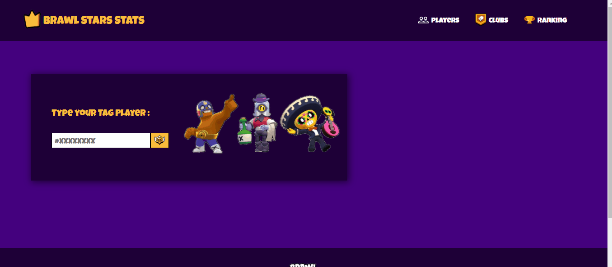
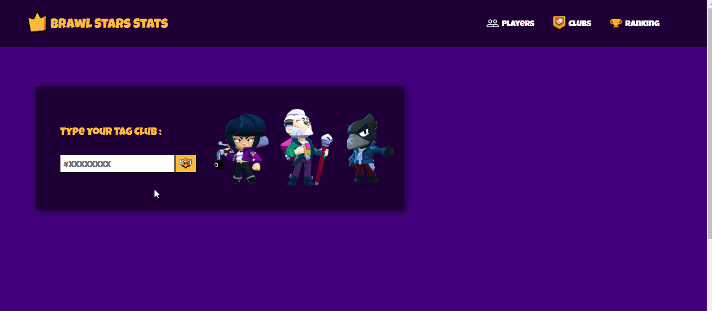
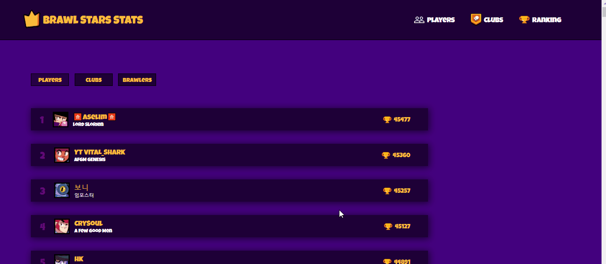
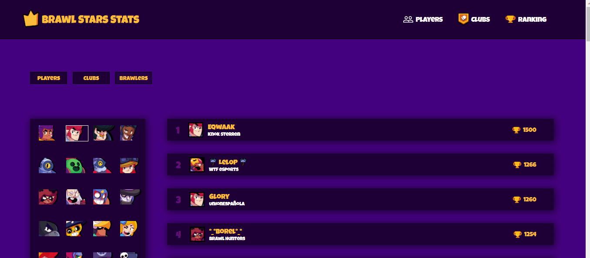

  
  
    Brawl Stars Stats
  

## Sobre

Aplicação que fornece estatísticas do famoso jogo mobile Brawl Stars .

O usuário consegue buscar por dados de sua conta , obtendo o número de troféus , vitórias e até visualizar seus Brawlers , entre outros dados .

 

 
 
Além disso o usuário pode buscar por Clubes também , obtendo a quantidade de troféus assim como todos seus membros .

 
 

 
 

Na aba Ranking , é possível visualizar o maior número de troféus da season dos Players , dos Clubes , e dos Brawlers .

Ranking e Clubs :

 

 
 

Brawlers :

 

 
 

A api utilizada neste projeto foi a <a href="https://developer.brawlstars.com/#/">Brawl Stars API</a> .

## Tecnologias

 

- ✔️ Next JS
- ✔️ Context API
- ✔️ Styled-Components
- ✔️ Axios
- ✔️ React Icons
