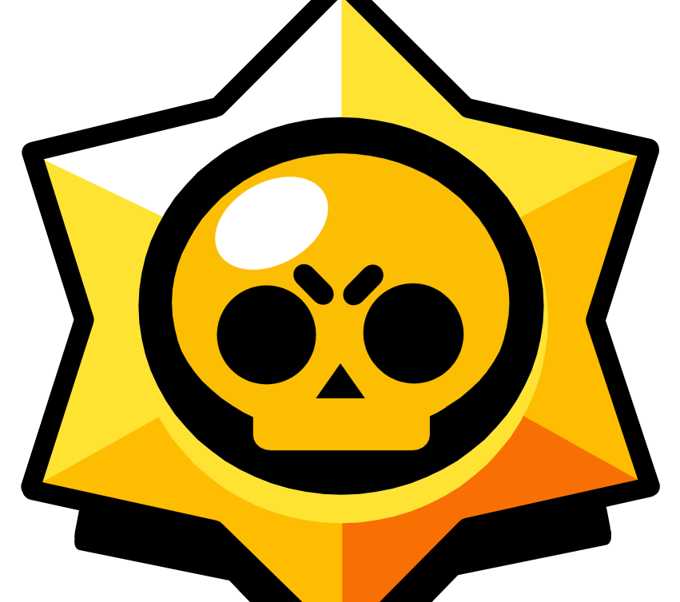
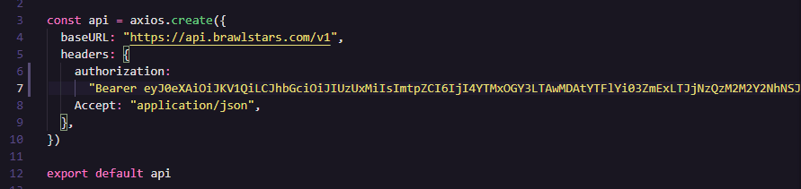

<h1 align="center">
    
    Brawl Stars Stats
</h1>

<p align="center">
    Brawl Stars Stats is an app that provides stats of Mobile Game Brawl Stars
</p>


<hr>

## Tecnologies

- ✔️ Next JS
- ✔️ Context API
- ✔️ Styled-Components
- ✔️ Axios
- ✔️ React Icons

<hr>

## 💻 Getting Started

### Requirements

- You need to install <a href="https://nodejs.org/en/download/">Node.js</a> to run this project.
- You need to create an account on <a href="https://developer.brawlstars.com/#/">Brawl Stars Official Api</a>, and then create a <a href="https://developer.brawlstars.com/#/new-key">key</a> with your IP address. 

**Clone the project and access the folder**

```bash
git clone https://github.com/rodrigo-miranda18/BrawlStars-Stats.git && cd brawlstars-stats
```

**Follow the steps below**

```bash
# Run this command to open that file on your text editor

code src/services/api.js .
```

<br>
<p>Copy the Token of your key and replace on file.</p>
<div>
    
</div>
<br>

```bash
# Install the dependencies
npm install
# or 
yarn install

# Build project
npm run build
# or
yarn build

# Run project
npm start
# ou
yarn start

# The app will be available for access on your browser at http://localhost:3000
```


